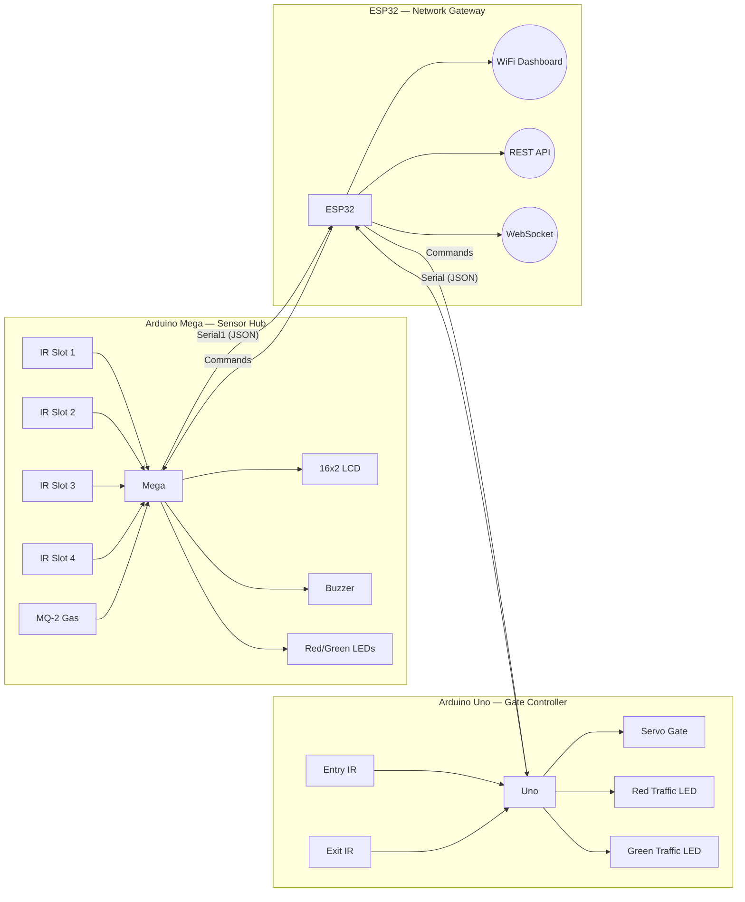

# 🅿️ Smart Parking System v4.0

**Multi-MCU IoT Smart Parking & Safety System — ESP32 + Arduino Mega + Arduino Uno**

> Distributed architecture: sensor hub, gate controller, and network gateway working in concert for real-time vehicle detection, gas monitoring, barrier gate control, and a premium web dashboard.

---

## ✨ Features

| Feature | Board | Description |
|---------|-------|-------------|
| **4-Slot Parking Detection** | Mega | IR obstacle sensors with software debouncing |
| **Gas/Smoke Monitoring** | Mega | MQ-2 sensor with logarithmic PPM calibration + warm-up detection |
| **3-Tier Alert System** | Mega | Normal → Warning → Danger with buzzer and LED patterns |
| **16x2 LCD Display** | Mega | Alternating slot status and gas readings with custom icons |
| **Servo Barrier Gate** | Uno | Automatic open/close with safety IR check |
| **Entry/Exit Detection** | Uno | IR sensors with debounced vehicle counting |
| **Traffic LEDs** | Uno | Red (lot full) / Green (spaces available) at gate |
| **WiFi Web Dashboard** | ESP32 | Glassmorphism dark-mode dashboard via WebSocket |
| **JSON REST API** | ESP32 | `/api/status` endpoint for external integrations |
| **Node Health Monitor** | ESP32 | Tracks Mega/Uno connectivity with 5s timeout |

---

## 🏗️ Architecture



---

## 🔧 Hardware Requirements

| Component | Qty | Board | Notes |
|-----------|-----|-------|-------|
| ESP32-WROOM-32D | 1 | Gateway | WiFi network coordinator |
| Arduino Mega 2560 | 1 | Sensors | Sensor hub + local alerts |
| Arduino Uno | 1 | Gate | Gate barrier controller |
| IR Obstacle Sensors | 4 | Mega | Parking slot detection (LOW = detected) |
| IR Obstacle Sensors | 2 | Uno | Entry + Exit detection |
| MQ-2 Gas Sensor | 1 | Mega | Analog output for smoke/LPG/CO |
| 16x2 LCD with I2C | 1 | Mega | PCF8574 backpack (addr 0x27) |
| SG90 Servo Motor | 1 | Uno | Barrier gate (0°=closed, 90°=open) |
| Active Buzzer | 1 | Mega | 5V, gas alert patterns |
| Red LED + 220Ω | 2 | Mega+Uno | Danger / lot full indicator |
| Green LED + 220Ω | 2 | Mega+Uno | Normal / available indicator |
| 1KΩ + 2KΩ Resistors | 2 sets | Wiring | Voltage dividers (5V→3.3V) |
| Breadboard + wires | — | All | Prototyping |

---

## 📌 Wiring

### Arduino Mega (Sensor Hub)

| Component | Mega Pin | Type |
|-----------|----------|------|
| IR Slot 1 | D22 | Digital Input |
| IR Slot 2 | D23 | Digital Input |
| IR Slot 3 | D24 | Digital Input |
| IR Slot 4 | D25 | Digital Input |
| MQ-2 AO | A0 | Analog Input |
| LCD SDA | D20 | I2C Data |
| LCD SCL | D21 | I2C Clock |
| Buzzer | D8 | Digital Output |
| Red LED | D9 | Digital Output |
| Green LED | D10 | Digital Output |
| TX1 → ESP32 | D18 | Serial ⚠️ via voltage divider |
| RX1 ← ESP32 | D19 | Serial |

### Arduino Uno (Gate Controller)

| Component | Uno Pin | Type |
|-----------|---------|------|
| Entry IR | D2 | Digital Input |
| Exit IR | D3 | Digital Input |
| Servo Gate | D9 | PWM Output |
| Red Traffic LED | D4 | Digital Output |
| Green Traffic LED | D5 | Digital Output |
| TX → ESP32 | D1 | Serial ⚠️ via voltage divider |
| RX ← ESP32 | D0 | Serial |

### ESP32 (Network Gateway)

| Function | ESP32 Pin | Type |
|----------|-----------|------|
| Mega RX | GPIO16 | UART2 Input |
| Mega TX | GPIO17 | UART2 Output |
| Uno RX | GPIO4 | UART1 Input |
| Uno TX | GPIO5 | UART1 Output |

### ⚠️ Voltage Divider (REQUIRED)

Arduino TX pins output 5V. ESP32 inputs accept 3.3V max. Use on each Arduino TX → ESP32 RX line:

```
Arduino TX (5V) ──[1KΩ]──┬── ESP32 RX (3.3V)
                          [2KΩ]
                          GND
```

---

## 🚀 Quick Start

### 1. Upload Mega Firmware
```bash
cd mega_sensors
pio run -t upload
pio device monitor        # Verify sensor readings
```

### 2. Upload Uno Firmware
> Disconnect ESP32 TX wire from Uno RX (D0) before uploading!
```bash
cd uno_gate
pio run -t upload
```

### 3. Upload ESP32 Firmware
Edit WiFi credentials first in `esp32_gateway/src/main.cpp`:
```cpp
const char* WIFI_SSID     = "YOUR_WIFI_SSID";
const char* WIFI_PASSWORD = "YOUR_WIFI_PASSWORD";
```
```bash
cd esp32_gateway
pio run -t upload
pio device monitor        # Get IP address
```

### 4. Connect & Test
Open the ESP32's IP address in any browser on the same WiFi network.

### Testing Without Hardware
Open `dashboard_preview/index.html` in any browser — click slots to toggle, drag gas slider, toggle gate.

---

## 📁 Project Structure

```
c:\IOT\
├── esp32_gateway/           ← ESP32 network gateway firmware
│   ├── platformio.ini
│   └── src/main.cpp
├── mega_sensors/            ← Arduino Mega sensor hub firmware
│   ├── platformio.ini
│   └── src/main.cpp
├── uno_gate/                ← Arduino Uno gate controller firmware
│   ├── platformio.ini
│   └── src/main.cpp
├── shared/
│   └── protocol.h           ← Communication protocol reference
├── dashboard_preview/
│   └── index.html            ← Interactive demo dashboard
├── README.md                 ← This file
└── SETUP_GUIDE.md            ← Detailed wiring & setup guide
```

---

## 🔌 API

**Endpoint:** `http://<ESP32-IP>/api/status`

```json
{
  "available": 3,
  "occupied": 1,
  "total": 4,
  "uptime": "1h 23m 45s",
  "gasPPM": 180.5,
  "gasLevel": 512,
  "gasStatus": "Normal",
  "gate": "closed",
  "vehicleCount": 12,
  "megaOnline": true,
  "unoOnline": true,
  "buzzer": false,
  "ledRed": false,
  "ledGreen": true,
  "slots": [
    {"id": 1, "occupied": false},
    {"id": 2, "occupied": true},
    {"id": 3, "occupied": false},
    {"id": 4, "occupied": false}
  ]
}
```

---

## ⚠️ Gas Alert Levels

| Level | PPM Range | Action |
|-------|-----------|--------|
| 🟢 Normal | 0 – 400 | Green LED, no buzzer |
| 🟡 Warning | 400 – 1000 | Both LEDs, slow buzzer chirp |
| 🔴 Danger | > 1000 | Red LED, fast buzzer, LCD override |

---

## 📄 License

This project is for educational purposes. Built as part of an IoT coursework project.
